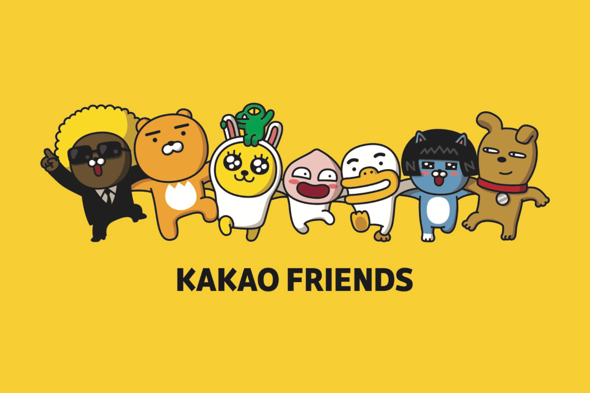
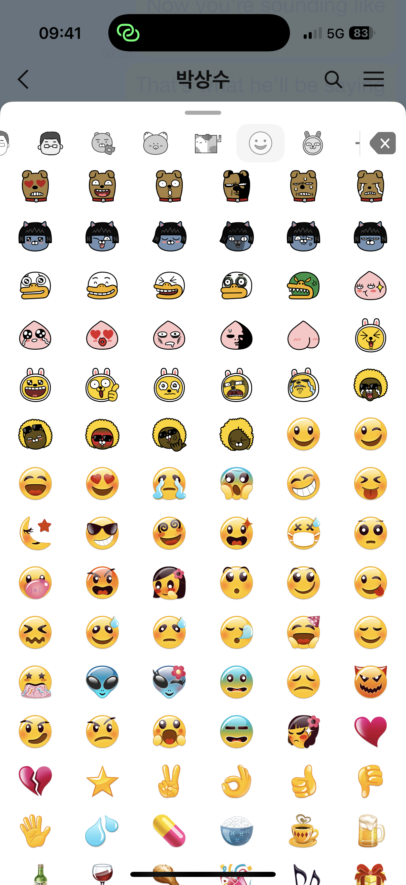
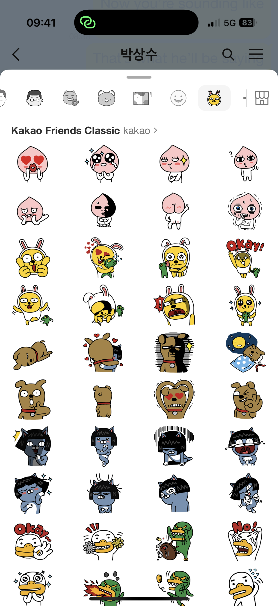
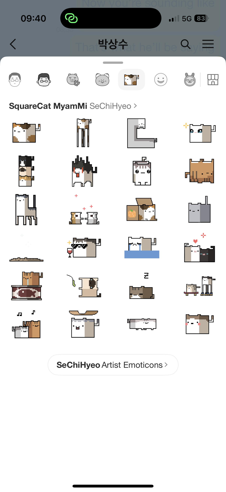
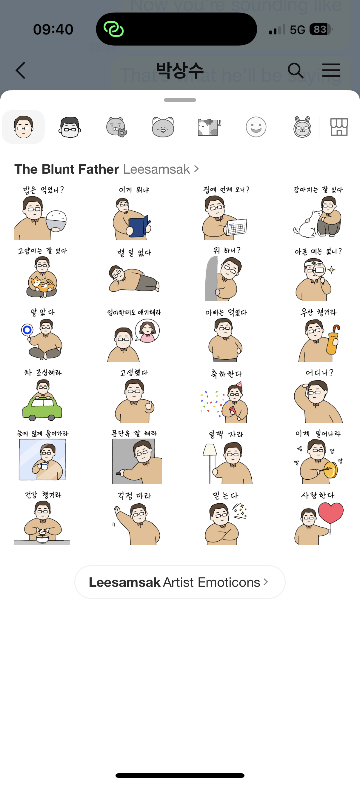
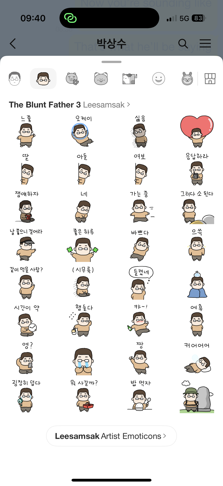

::: column-margin
<small>    [Sun Sun Lim](https://www.sunsunlim.com/), "[On Stickers and Communicative Fluidity in Social Media](https://journals.sagepub.com/doi/epub/10.1177/2056305115578137)"  Sunny Yoon, "[Webtoons, Desperately Seeking Viewers: Interactive Creativity in Social Media Platforms and Cultural Appropriation of Global Media Production](https://journals.sagepub.com/doi/epub/10.1177/20563051241292577)"  Kate M. Miltner and Tim Highfield, "[Never Gonna GIF You Up: Analyzing the Cultural Significance of the Animated GIF](https://journals.sagepub.com/doi/epub/10.1177/2056305117725223)"  Luke Stark and Kate Crawford, "[The Conservatism of Emoji: Work, Affect, and Communication](https://journals.sagepub.com/doi/epub/10.1177/2056305115604853)" </small>
:::

So far in the course we've talked a lot about **content**---influencers, platforms, cultures---but we haven't talked about **forms**. So I wanted us to spend a week thinking about and discussing social media forms that in some cases have become so familiar and taken for granted that they have become almost transparent. 

Looking at social media forms also opens up the question of cultural difference, as Sun Sun Lim's short article about stickers reveals. Animated stickers are a staple of Asian social media and have been the subject of extensive scholarship for that reason, yet they are less heavily used in Western and Anglo-American social media culture. It's interesting to think about why that is, but the reasons are clearly complex and related to larger cultural differences in societies where social and cultural norms are clearly very different from those of North American and European societies. This "communicative fluidity", as she suggests, is related to the concept of "high-context cultures" that she also discusses, and the different social norms around emotional expression in everyday interacations in particular. In this sense the widespread use of animated stickers on platforms such as Kakao Talk (South Korea), WeChat (China), or Line (Japan) can be seen as a kind of compensatory practice, where they serve to add an emotional register to plain text messages. We Westerners are all very familiar with using emoji and animated gifs for this, but the cartoonish nature of animated stickers not only add a dynamic element to text messages but also an affective dimension (pronounced **A**-fect, as in emotion). 

An additional aspect of the animated sticker phenonemon in Asian social media, which Sun Sun Lim doesn't mention, is also maybe so obvious that it's easily overlooked: that the animations depict **characters**. The ubiquity of such communicative characters has been extensively discussed in academic studies of Asian social media cultures but is itself part of the larger phenomenon that myself and some other scholars described as the **character industry** in the early 2000s (I have to get around to re-posting the papers from that panel this summer).

Perhaps the best-known recent example of this in the West is the case of the [Kakao Friends](https://en.wikipedia.org/wiki/Kakao_Friends) in South Korea:



These characters started out as sticker mascots and merchandise for the Kakao Talk mobile chat app, but they have since developed well beyond that into a major cultural brand that takes a multiplicity of forms across both digital and material culture, from printed stickers to plushies to stationery to animated short videos. You can find out more about them [here](https://www.knowingkorea.org/contents/view/246/Kakao-Friends-Stores-the-newest-famous-store-in-Hongdae). If you have the Kakao Talk app you can even install them in it yourself from the iPHone [App Store](https://apps.apple.com/us/app/hello-kakao-friends/id1451176667). You can find out more about the Kakao Friends on their [official website](https://store.kakao.com/kakaofriends).

The point to keep in mind here is that as ubiquitous as they are, when it comes to social media characters the Kakao Friends are no more than the tip of the iceberg. Even on the Kakao Talk platform alone, there are innumerable animated **sticker packs** depicting a host of other animated characters. You can customize these to any aspect of your own identity, personal style, or sense of humor. Some examples.

::: {.column-margin}

{.lightbox group="kk-stickers" width=50}{.lightbox group="kk-stickers" width=50}{.lightbox group="kk-stickers" width=50}{.lightbox group="kk-stickers" width=50}{.lightbox group="kk-stickers" width=50}{.lightbox group="kk-stickers" width=50}

:::

**Animated GIFs and the DIY Web**\

Although you may have been interested to discover another staple of Asian social media culture, webtoons, I'm guessing that the article you found most interesting among this week's reading assignments was the one about animated GIFs. ;)

In case you're wondering actually how to pronounce it, this video by Mike Rugnetta should sort you out with that (though "zhaif" will never catch on ;)



This other (shorter!) video is arguably more interesting, about the impact of GIFs on the visual language of music videos:



As these somewhat old videos exemplify, GIFs have been around since the early days of the internet and the fascination with them is by no means recent. The recent historicization of the animated GIF though (exemplified by this week's reading assignment) is itself part of a larger historicization---not to mention romanticization---of what is referred to as the **early internet** or the **early web**. Whatever you call it, there is currently a wave of nostalgia for the culture of the early 1990s web that predates the onset of social media platforms in the mid-2000s. A particular focus of this nostalgia has been on the quaint design of early personal websites on the GeoCities platform, now recreated in the site [neocities](https://neocities.org/). This in part has taken the form of a kind of museumization of the internet/web from that period, observable everywhere from the [Internet Archive](https://en.wikipedia.org/wiki/Internet_Archive) to more specific digital museum pieces. One of the most interesting examples of this are archival collections of animated GIFs from early 1990s homepages and other sites of the early web. Two particularly iconic examples are the animated [Under Construction](http://www.textfiles.com/underconstruction/) GIFs that were commonly used on websites as they were still being built, and an amazing collection of [GIF buttons](https://cyber.dabamos.de/88x31/index.html) dating from the same era. Maybe you'll be inspired to repurpose some of them and build your own [DIY homepage](https://www.youtube.com/embed/erSg5Su7d5g)!

If you're interested in finding out more about the history of the early web and the current nostalgia for it, this video is a good place to start. I look forward to hearing your reflections on this week's readings and the above discussion of them!



***